# **Решение задания 1**

Ссылка: https://hub.docker.com/repository/docker/jefijfire/custom-nginx/general  

---

# **Решение задания 2**

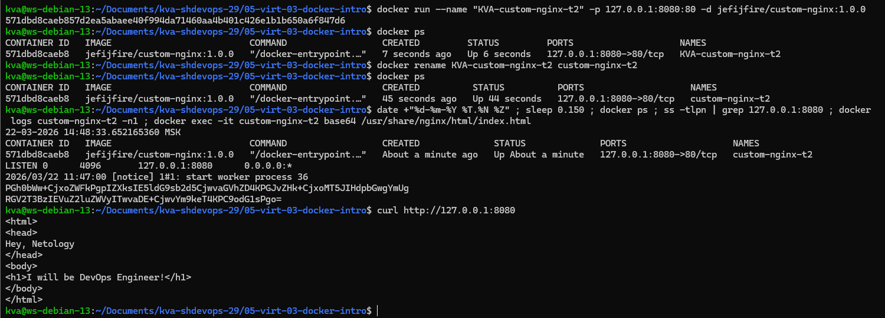  

---

# **Решение задания 3**

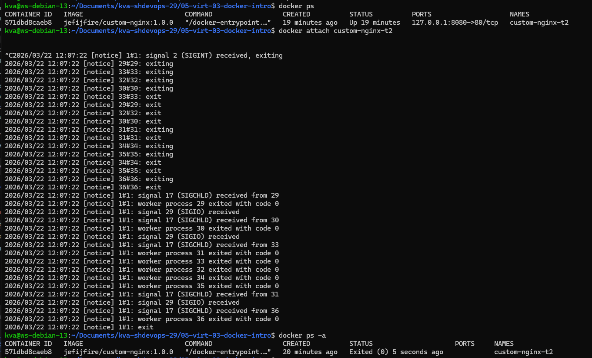  
Пояснение к произошедшему:  
Мы подключились к стандартному потоку ввода/вывода/ошибок контейнера командой `docker attach custom-nginx-t2`, что по своей сути подключиться к процессу PID 1 контейнера. Нажатие комбинации CTRL+C в Linux отправляет сигнал SIGINT текущему процессу, что в данном случае привело к завершению, а значит и сам контейнер остановился.  

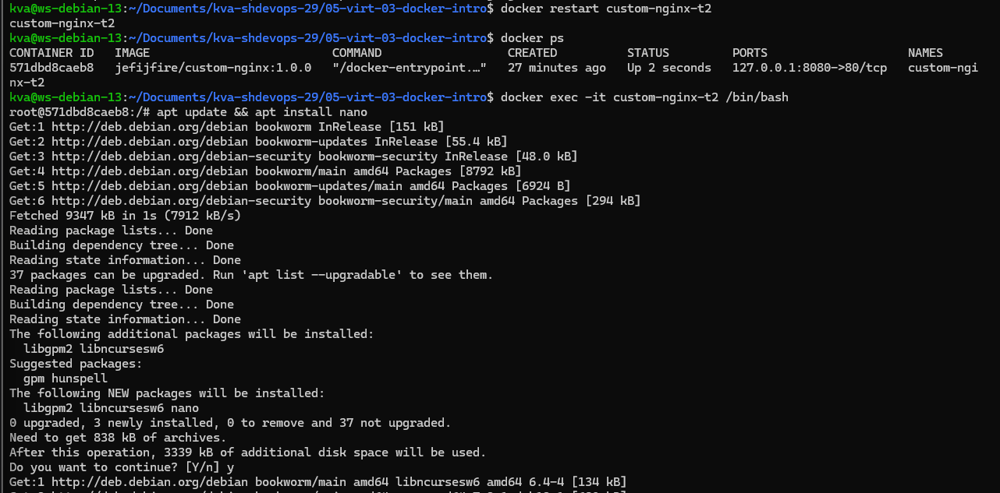  

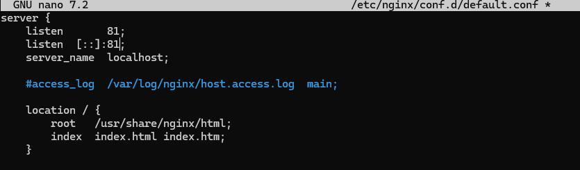  

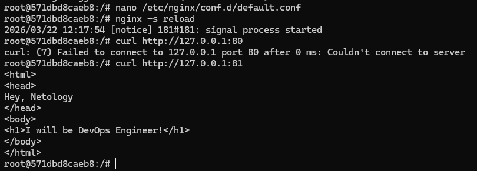  
Дополнение: вышел командой `exit`, она не попала на скриншот.  

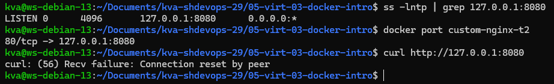  
Пояснение к произошедшему:  
Собственно мы в конфиги nginx поменяли порт, который слушает программа с 80 на 81. И теперь, при попытке обращения на 80 порт отдается ошибка. А так как у нас контейнер поднят с пробросом локального порта хоста 8080 к порту контейнера 80 - мы получаем тот же результат, ошибку.  

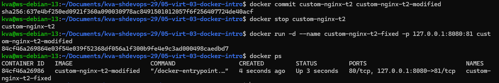  
Дополнение по пункту 11 и решение пукнта 12:  
Так как был поднят новый контейнер (старый не удален, его было видно в выводе `docker ps -a`) с указанием уже на порт 81, то и удалял запущенный контейнер уже командой `docker rm -f custom-nginx-t2-fixed`.  

---

# **Решение задания 4**

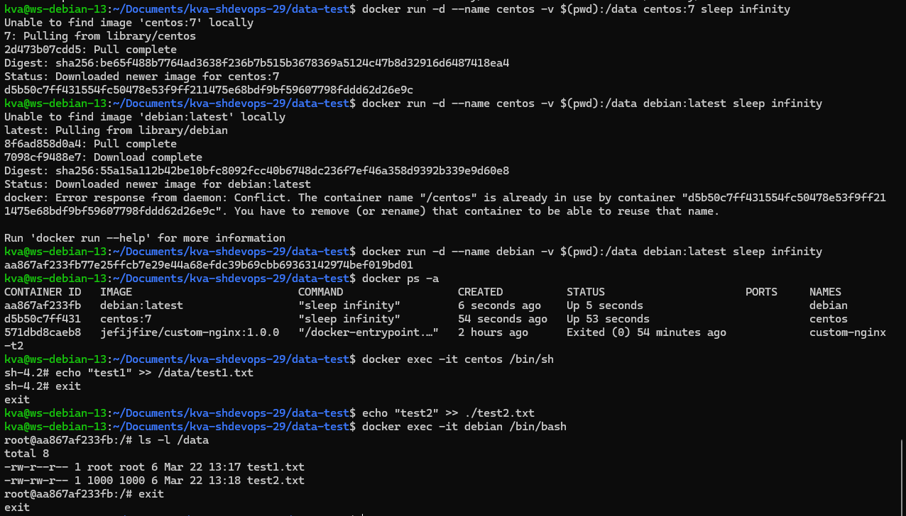  
Дополнение:  
На скриншоте можно заметить, что в первый раз запуск контейнера с debian завершился с ошибкой. Это я забыл изменить имя в команде, то есть система попыталась запустить контейнер с именем, которое уже есть.  

---

# **Решение задания 5**

Итоговый compose.yaml выглядит следующим образом:  
```
version: "3"
services:
  portainer:
    network_mode: host
    image: portainer/portainer-ce:latest
    volumes:
      - /var/run/docker.sock:/var/run/docker.sock

  registry:
    image: registry:2

    ports:
    - "5000:5000"
```

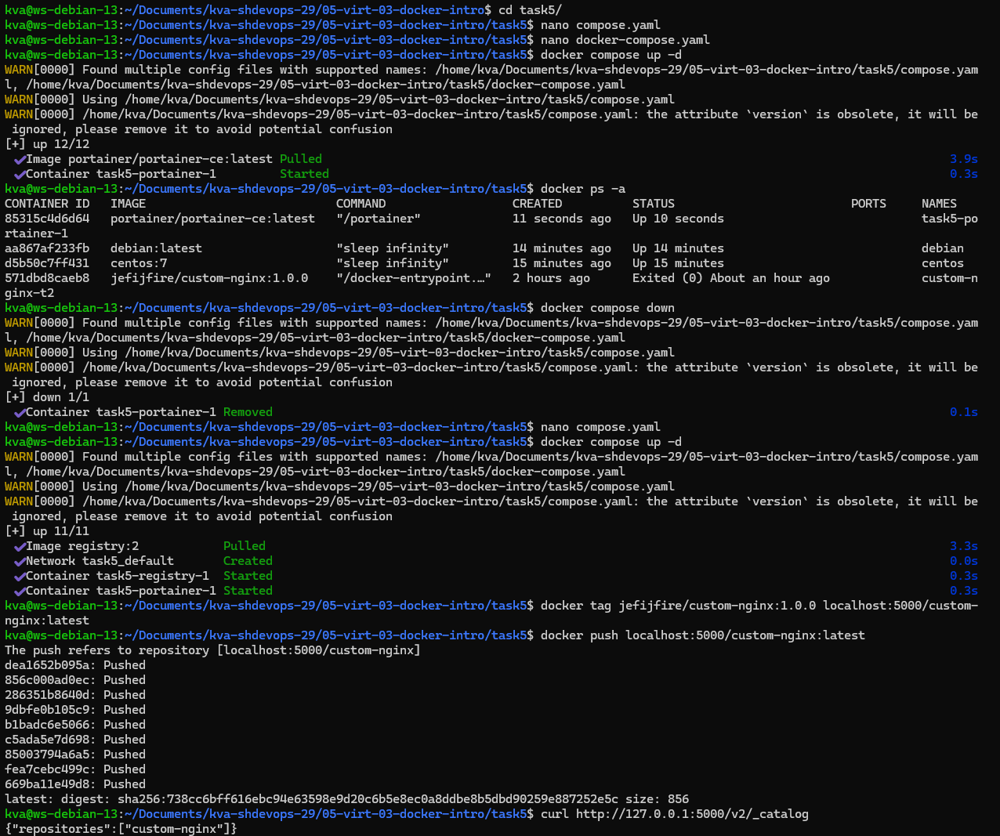  
Пояснение к заданию:  
При выполнение команды `docker compose up -d` запустился файл именно compose.yaml, потому что файл docker-compose считается устаревшим, но может быть запущен. Для системы compose.yaml в приоритете.  

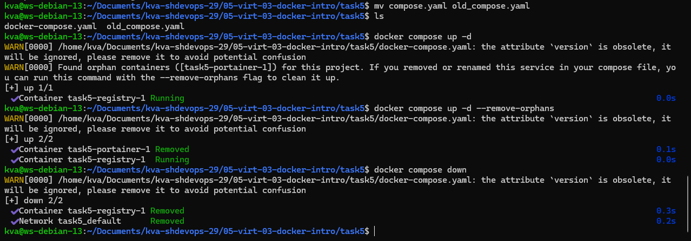  
Пояснение к заданию:  
После переименования файла compose.yaml в old_compose.yaml, docker запустился уже с docker-compose.yaml. В этом файле не был описан сервис portainer, поэтому docker предупреждает об "осиротевшем" контейнере и предлагает запустить с ключем --remove-orphans.  

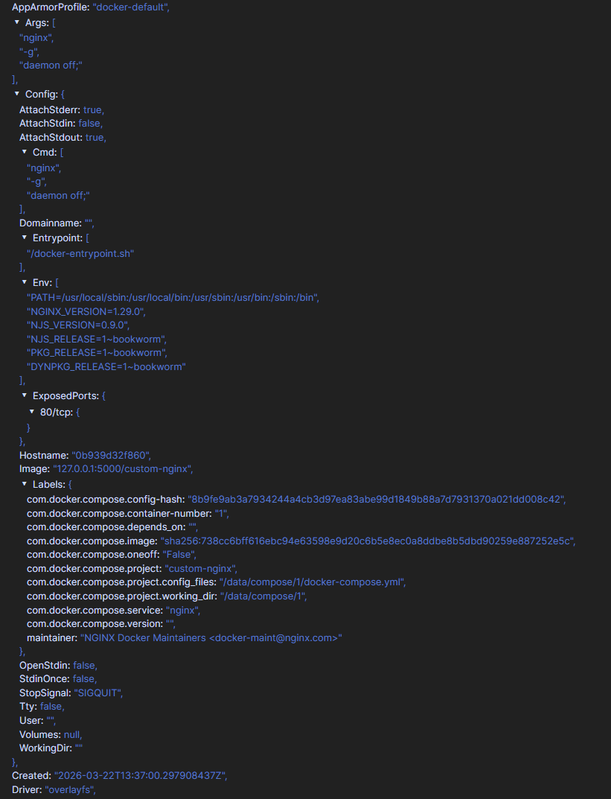  

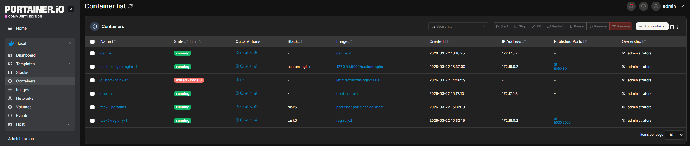  

---
