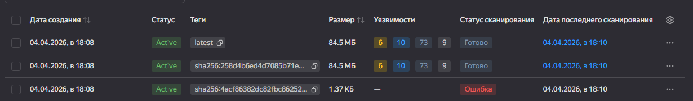
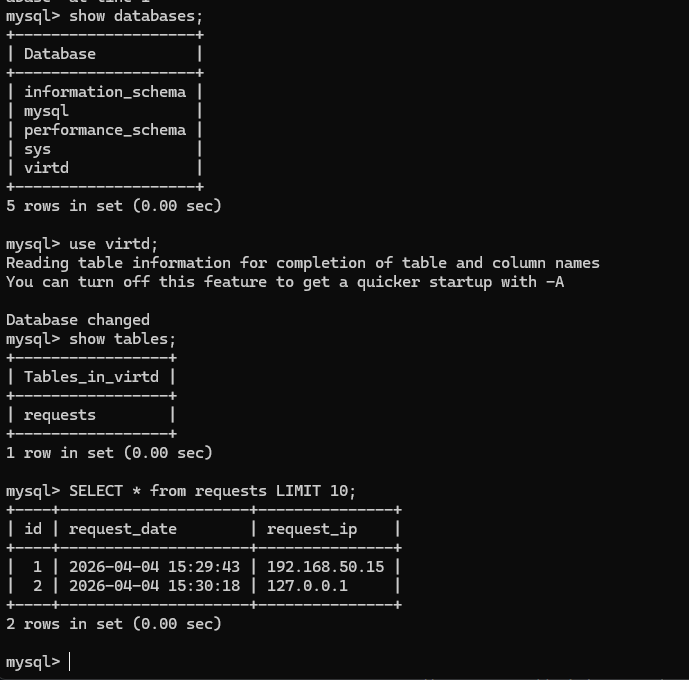
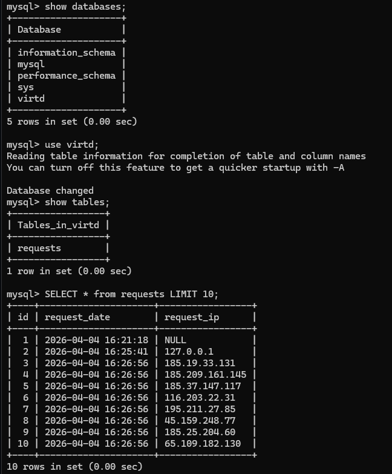
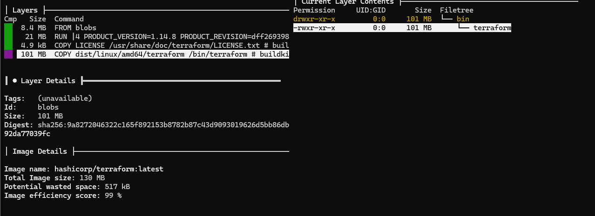
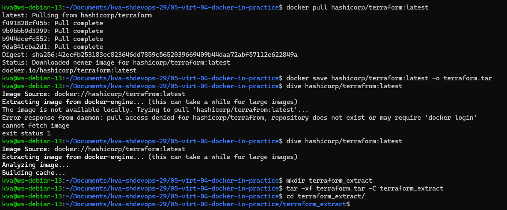
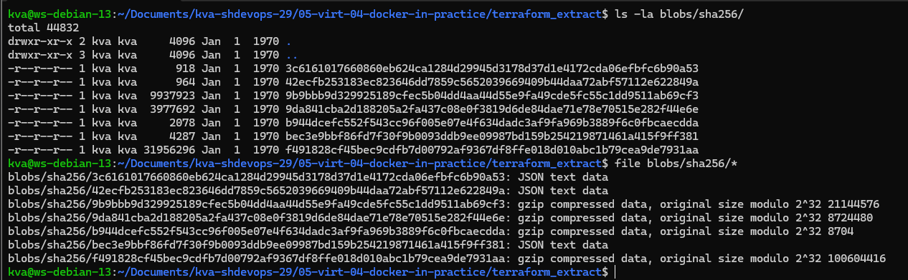
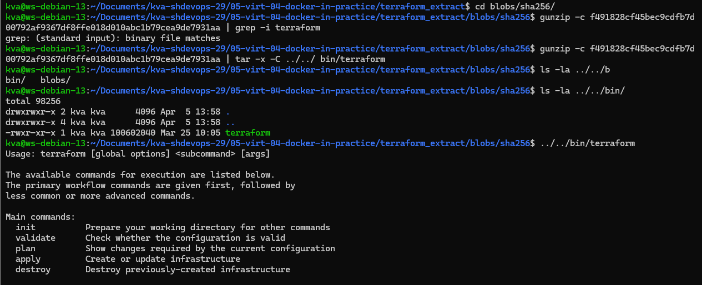
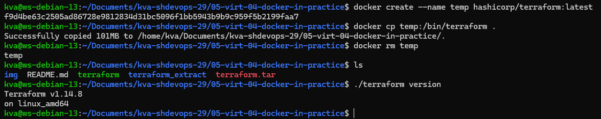

# **[Ссылка на форк-репозиторий](https://github.com/JefiJFire/shvirtd-example-python)**
---

# **Решение задания 1**

Получившийся Dockerfile.python:
```
#---Stage_1---
FROM python:3.12-slim AS builder

WORKDIR /app

COPY requirements.txt .

RUN pip install --user --no-cache-dir -r requirements.txt

#---Stage_2---
FROM python:3.12-slim

WORKDIR /app
COPY --from=builder /root/.local /root/.local
ENV PATH="/root/.local/bin:$PATH"
COPY . .

CMD ["uvicorn", "main:app", "--host", "0.0.0.0", "--port", "5000"] 
```

---

# **Решение задания 2**

  

---

# **Решение задания 3**

  

---

# **Решение задания 4**

  
Ссылка на форк: https://github.com/JefiJFire/shvirtd-example-python

---

# **Решение задания 6**

  
  
  
  
Пояснение:  
Через dive я получил другой ID слоев, поэтому я стал упираться на размер в 101МБ. Нашел интересующий меня слой в папке, сначала проверил, что в нем существуют terraform, а потом произвел распаковку в нужную мне папку.

---

# **Решение задания 6.1**

  
