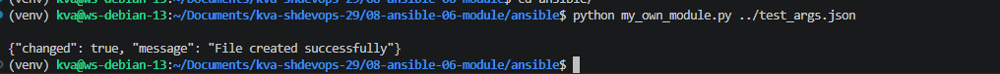
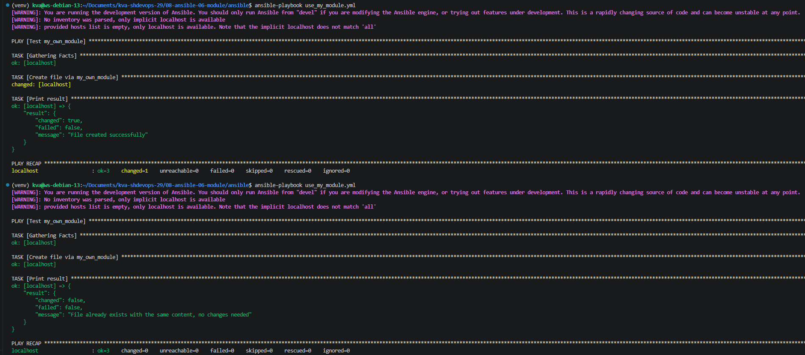
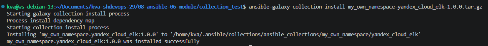
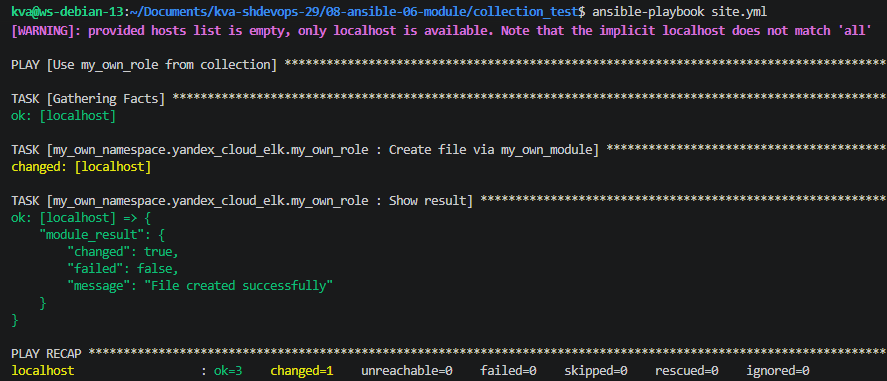

# Домашнее задание к занятию 6 "Создание собственных модулей"

## Ссылки
Репозиторий [my_own_collection](https://github.com/JefiJFire/my_own_collection).  
Архив [.tar.gz](https://github.com/JefiJFire/my_own_collection/blob/main/my_own_namespace-yandex_cloud_elk-1.0.0.tar.gz).

## Скриншоты
Скриншот Шага 4 (прямой запуск модуля)  
  

Скриншот Шага 6 (второй запуск playbook, `changed=false`)  
  

Скриншот Шага 15 (установка коллекции)  
  

Скриншот Шага 16 (финальный запуск playbook)  
  
---