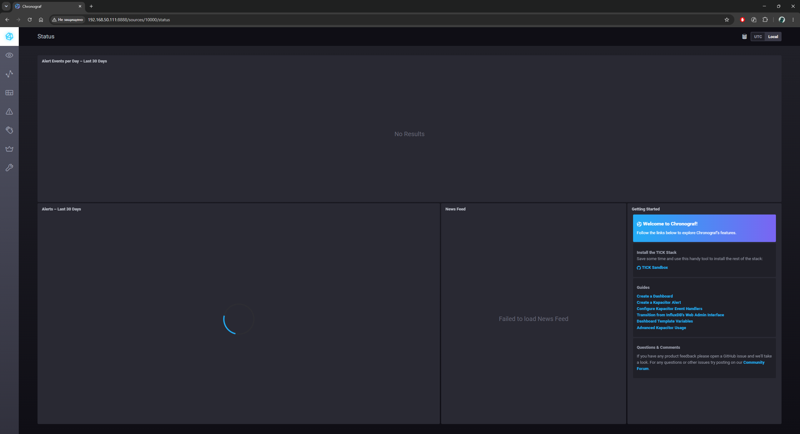
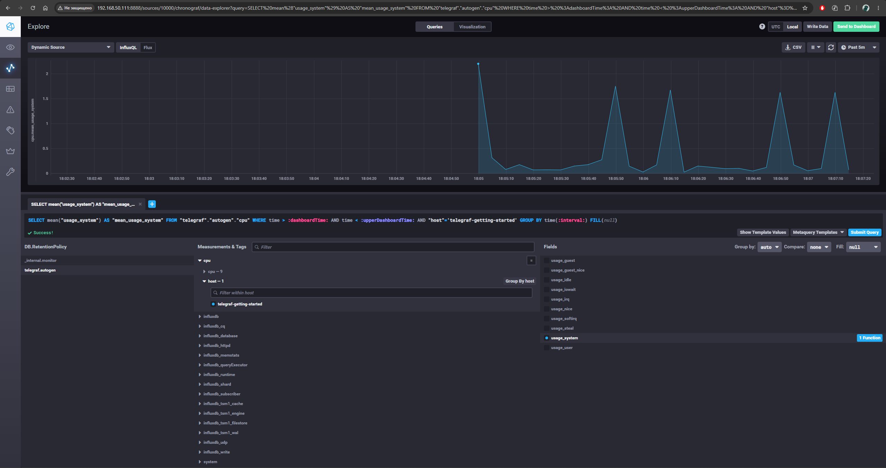

# Домашнее задание к занятию "13.Системы мониторинга"

## Обязательные задания

1. Вас пригласили настроить мониторинг на проект. На онбординге вам рассказали, что проект представляет из себя 
платформу для вычислений с выдачей текстовых отчетов, которые сохраняются на диск. Взаимодействие с платформой 
осуществляется по протоколу http. Также вам отметили, что вычисления загружают ЦПУ. Какой минимальный набор метрик вы
выведите в мониторинг и почему?

### Решение задания:
Минимальный набор метрик хоста:  
- CPU (usage, load average) - так как платформа CPU-зависимая, то это ключевые ресурсы;
- RAM (used, free, aailable, swap usage) - отслеживание нехватки памяти и деградацию;
- Disk space (использование, остаточное свободное место) - в проекте отчеты пишутся на диск, необходимо отслеживать и предвосхищать риски переполнения;
- Disk I/O - чтобы мониторить скорость записи/чтения данных на диски и отслеживать их деградацию.

Минимальный набор метрик приложения:
- Количество запросов (RPS);
- HTTP коды ответов - проверять доступность и ошибки системы;
- Время отклика;
- Количество активных соединений.

За счет метрик хоста мы сможем прогнозировать дальнешие обновление оборудования, также от состояния этих ресурсов зависит работоспособность приложения. Метрики приложения позволят нам отследить за состоянием продукта со стороны "клиента" и взаимосвязывать с метриками хоста. Например, если у нас увеличилось количество операций по записи на диски, то можно будет сравнить с количеством активных пользователей и спрогнозировать дальнейший рост.

#
2. Менеджер продукта посмотрев на ваши метрики сказал, что ему непонятно что такое RAM/inodes/CPUla. Также он сказал, 
что хочет понимать, насколько мы выполняем свои обязанности перед клиентами и какое качество обслуживания. Что вы 
можете ему предложить?

### Решение задания:
Предоставление менеджеру отдельного дашборда, который будет из имеющихся данных преобразовывать в бизнес-ориентированные показатели (SLA\SLO):
- Availability (доступность) - % успешных запросов от всех запросов за период (например, для потверждения установленного стандарта доступности в 99.9% uptime);
- Latency (время отклика) - сколько в среднем или в худшем случае клиент ждет свой отчет;
- Error rate - доля ошибок, которые видит клиент;
- Throughput - сколько отчетов/запросов обрабатывается в единицу времени.


#
3. Вашей DevOps команде в этом году не выделили финансирование на построение системы сбора логов. Разработчики в свою 
очередь хотят видеть все ошибки, которые выдают их приложения. Какое решение вы можете предпринять в этой ситуации, 
чтобы разработчики получали ошибки приложения?

### Решение задания:
Из личной практики - было принято решение использования связки Loki+Promtail+Grafana, с настройкой интересующих метрик хостов и доступности приложений (как из задания 1). Группам разработчиков в Grafana предоставлялся доступ до дашбордов с их приложениями.


#
4. Вы, как опытный SRE, сделали мониторинг, куда вывели отображения выполнения SLA=99% по http кодам ответов. 
Вычисляете этот параметр по следующей формуле: summ_2xx_requests/summ_all_requests. Данный параметр не поднимается выше 
70%, но при этом в вашей системе нет кодов ответа 5xx и 4xx. Где у вас ошибка?

### Решения задания:
Ошибка непосредственно в самой метрике. Нужно проверить, откуда берутся числитель и знаменатель, и убедиться, что они считаются из одного источника за один и тот же период. Также стоит убедится, что в `sum_all_request` не попадаются запросы, которые не завершились HTTP-ответом вообще (таймауты, обрывы соединения, 3хх-редиректы).

#
5. Опишите основные плюсы и минусы pull и push систем мониторинга.

### Решение задания:
Pull:
(+) - Сервер контролирует нагрузку и частоту опроса; легко видеть, что цель недоступна (нет ответа); не нужно настраивать на каждом отдельном хосте
(-) - Обязательная сетевая доступность от сервера мониторинга до целей (проблема с NAT/firewall); плохо подходит для batch/cron задач, которые быстро завершаются.
Push:
(+) - Хорошо работает за NAT/firewall; источник сам решает, когда слать данные; агенты самостоятельно собирают метрики с хоста.
(-) - Сложнее понять, недоступен ли источник или просто перестал слать метрики; сервер мониторинга должен быть готов принимать нагрузку от всех агентов сразу.

#
6. Какие из ниже перечисленных систем относятся к push модели, а какие к pull? А может есть гибридные?

    - Prometheus 
    - TICK
    - Zabbix
    - VictoriaMetrics
    - Nagios

### Решение задания:

    - Prometheus - Pull по умолчанию, но есть pushgateway для push-сценариев, так что по сути гибрид;
    - TICK - Push;
    - Zabbix - гибрид;
    - VictoriaMetrics - Pull по умолчанию, но поддерживает push через remote_write и различные протоколы, так что гибрид;
    - Nagios - Pull, но есть NSCA для passive/push-проверок.

#
7. Склонируйте себе [репозиторий](https://github.com/influxdata/sandbox/tree/master) и запустите TICK-стэк, 
используя технологии docker и docker-compose.

В виде решения на это упражнение приведите скриншот веб-интерфейса ПО chronograf (`http://localhost:8888`). 

P.S.: если при запуске некоторые контейнеры будут падать с ошибкой - проставьте им режим `Z`, например
`./data:/var/lib:Z`

### Решение задания:


#
8. Перейдите в веб-интерфейс Chronograf (http://localhost:8888) и откройте вкладку Data explorer.
        
    - Нажмите на кнопку Add a query
    - Изучите вывод интерфейса и выберите БД telegraf.autogen
    - В `measurments` выберите cpu->host->telegraf-getting-started, а в `fields` выберите usage_system. Внизу появится график утилизации cpu.
    - Вверху вы можете увидеть запрос, аналогичный SQL-синтаксису. Поэкспериментируйте с запросом, попробуйте изменить группировку и интервал наблюдений.

Для выполнения задания приведите скриншот с отображением метрик утилизации cpu из веб-интерфейса.
#
9. Изучите список [telegraf inputs](https://github.com/influxdata/telegraf/tree/master/plugins/inputs). 
Добавьте в конфигурацию telegraf следующий плагин - [docker](https://github.com/influxdata/telegraf/tree/master/plugins/inputs/docker):
```
[[inputs.docker]]
  endpoint = "unix:///var/run/docker.sock"
```

Дополнительно вам может потребоваться донастройка контейнера telegraf в `docker-compose.yml` дополнительного volume и 
режима privileged:
```
  telegraf:
    image: telegraf:1.4.0
    privileged: true
    volumes:
      - ./etc/telegraf.conf:/etc/telegraf/telegraf.conf:Z
      - /var/run/docker.sock:/var/run/docker.sock:Z
    links:
      - influxdb
    ports:
      - "8092:8092/udp"
      - "8094:8094"
      - "8125:8125/udp"
```

После настройке перезапустите telegraf, обновите веб интерфейс и приведите скриншотом список `measurments` в 
веб-интерфейсе базы telegraf.autogen . Там должны появиться метрики, связанные с docker.

### Решение задания 8 и 9:
