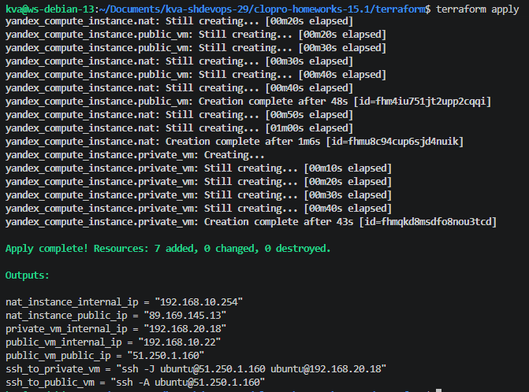
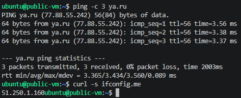
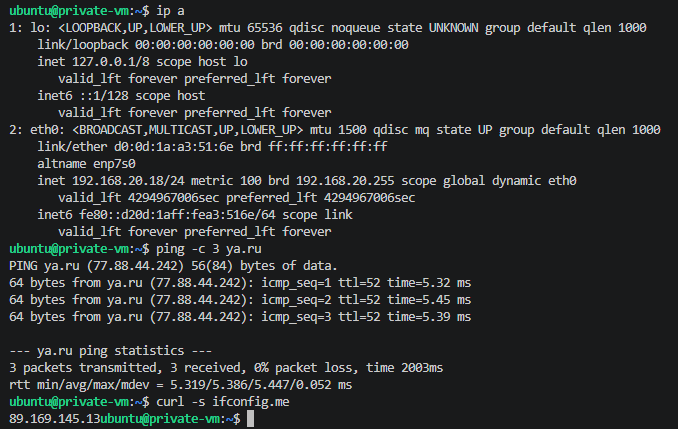
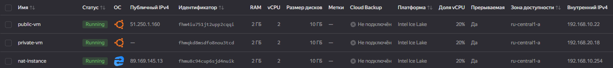
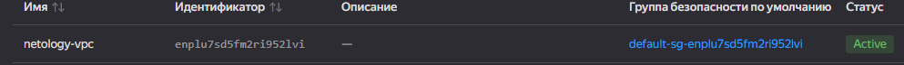
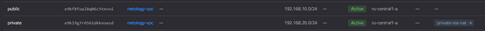
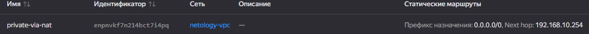

## Задание 1. Yandex Cloud 
- [terraform/providers.tf](terraform/providers.tf)  
- [terraform/compute.tf](terraform/compute.tf)  
- [terraform/network.tf](terraform/network.tf)  
- [terraform/outputs.tf](terraform/outputs.tf)
- [terraform/variables.tf](terraform/variables.tf)

### Вывод ```terraform apply```
  

### Проверка сети на public-vm 
  

### Проверка сети на private-vm
  

### Скриншоты из панели Yandex Cloud  
  
  
  

