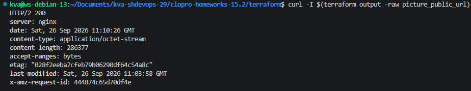
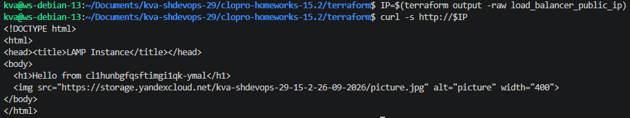
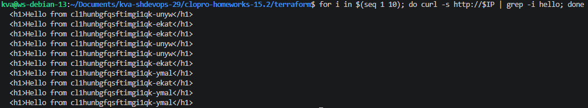
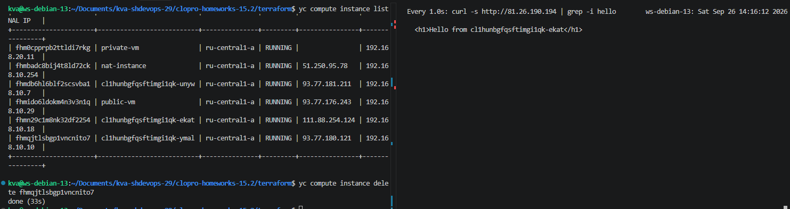
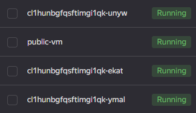
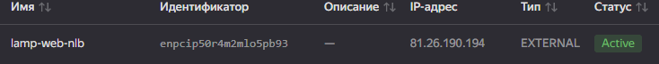
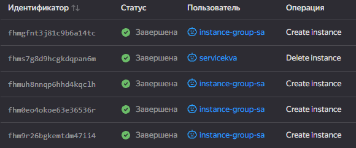

## Задание 1. Yandex Cloud 
- [terraform/providers.tf](terraform/providers.tf)  
- [terraform/loadbalancer.tf](terraform/loadbalancer.tf)  
- [terraform/storage.tf](terraform/storage.tf)  
- [terraform/outputs.tf](terraform/outputs.tf)  
- [terraform/instance_group.tf](terraform/instance_group.tf)  
- [terraform/data.tf](terraform/data.tf)  
- [terraform/variables.tf](terraform/variables.tf)

### Вывод ```curl``` для picture_public_url
  

### Вывод ```curl``` для load_balancer_public_ip
  

### Вывод ```curl``` для проверки балансировки
  

### Вывод ```curl``` в момент удаления одной из ВМ  


### Скриншоты из панели Yandex Cloud  
  
  

### Скриншот историй операций с ВМ  

