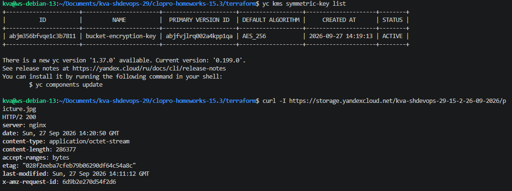
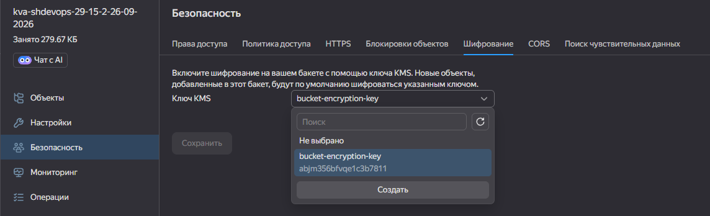
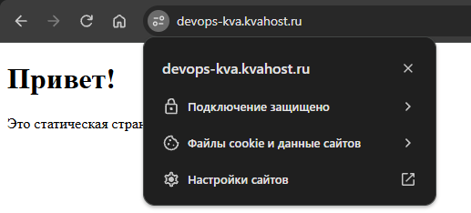
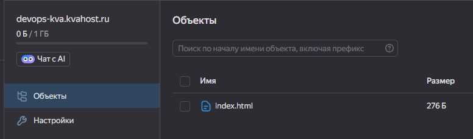
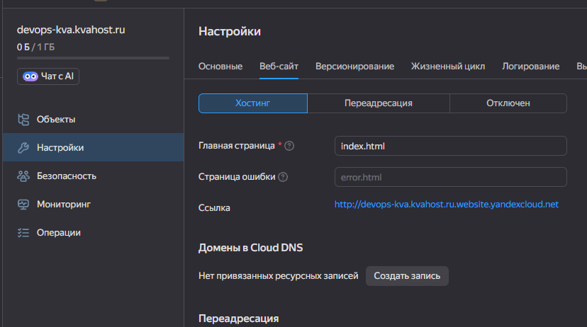
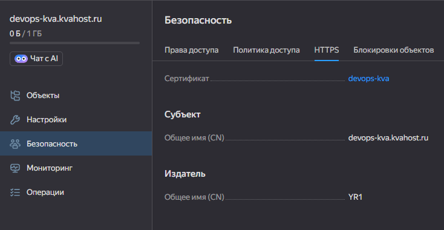
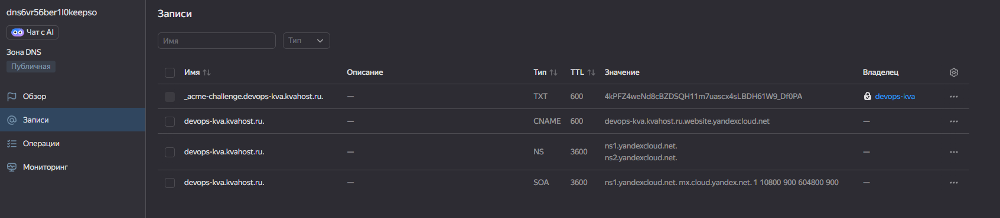

## Задание 1. KMS 
- [terraform/providers.tf](terraform/providers.tf)  
- [terraform/encryption.tf](terraform/encryption.tf)  
- [terraform/kms.tf](terraform/kms.tf)  
- [terraform/outputs.tf](terraform/outputs.tf)  
- [terraform/variables.tf](terraform/variables.tf)

### Провекра ключа через ```yc-cli``` и доступность через ```curl```
  

### Скриншот из панели Yandex Cloud на применение ключа к Object Storage
  

## Задание 2. SSL-сертификат через Lets Encrypt и подключение DNS-имени  

### Проверка сертификата  
  

### Скриншоты из панели Yandex Cloud  
  
  
  
