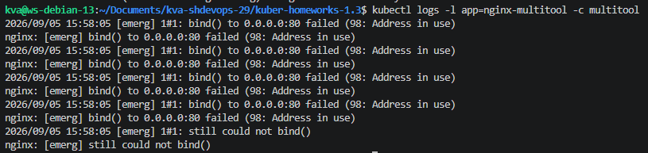
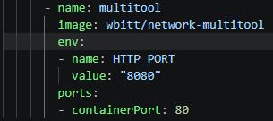
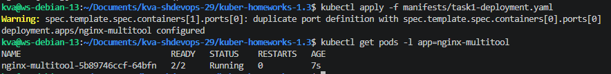
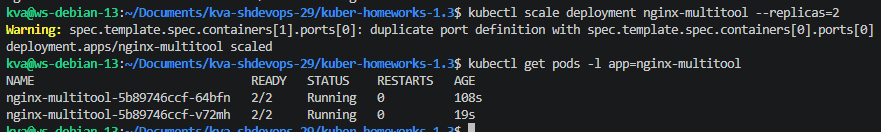
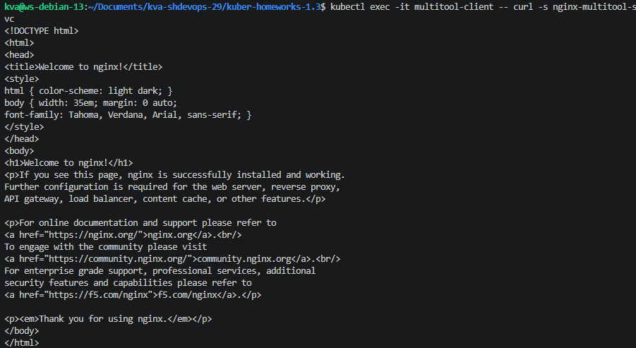
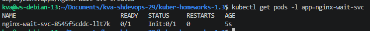
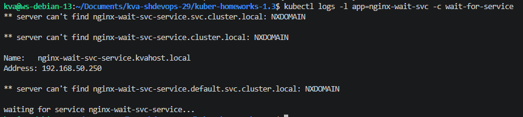
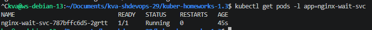
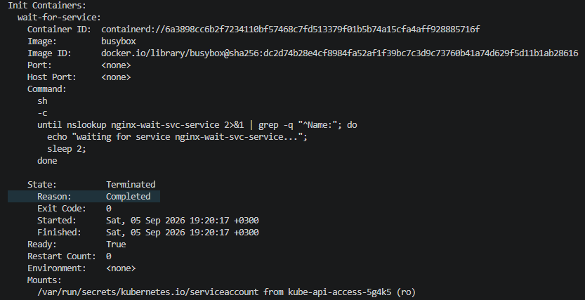

## Задание 1
- [manifests/task1-deployment.yaml](manifests/task1-deployment.yaml)
- [manifests/task1-service.yaml](manifests/task1-service.yaml)
- [manifests/task1-client-pod.yaml](manifests/task1-client-pod.yaml)

### Ошибка при первом старте
Контейнер multitool конфликтовал по порту 80 с nginx (оба в одном network namespace пода).

### Исправление
Порт multitool переопределён через переменную HTTP_PORT=8080.  

### Поды до масштабирования

### Поды после масштабирования (replicas=2)

### Доступ из отдельного Pod через Service
  

## Задание 2
- [manifests/task2-deployment.yaml](manifests/task2-deployment.yaml)
- [manifests/task2-service.yaml](manifests/task2-service.yaml)

### Под до создания Service
Init-контейнер busybox не может зарезолвить DNS-имя Service, nginx не стартует.
  
  

### Под после создания Service
Init-контейнер успешно резолвит имя и завершается, основной контейнер nginx запускается.

