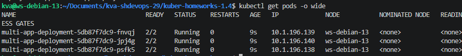
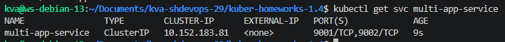
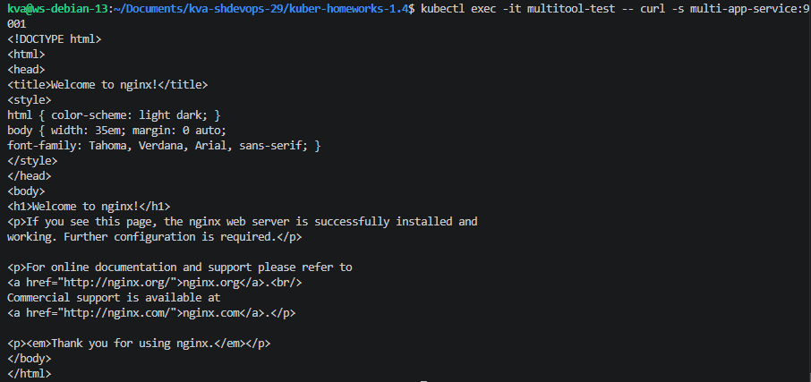
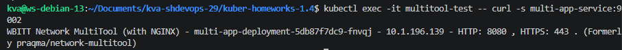
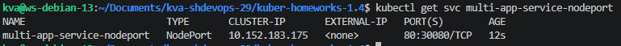
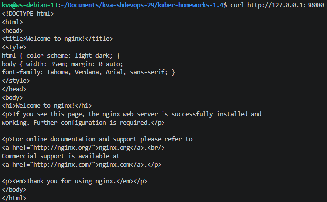

## Задание 1
- [manifests/deployment.yaml](manifests/deployment.yaml)
- [manifests/service-clusterip.yaml](manifests/service-clusterip.yaml)
- [manifests/test-pod.yaml](manifests/test-pod.yaml)

### Запуск и проверка Deployment

### Запуск и проверка Service-clusterip 

### Проверка доступа curl'ом из тестового Pod'а
  

## Задание 2
- [manifests/service-nodeport.yaml](manifests/service-nodeport.yaml)

### Запуск и проверка Service-nodeport
  

### Проверка доступа снаружи кластера
