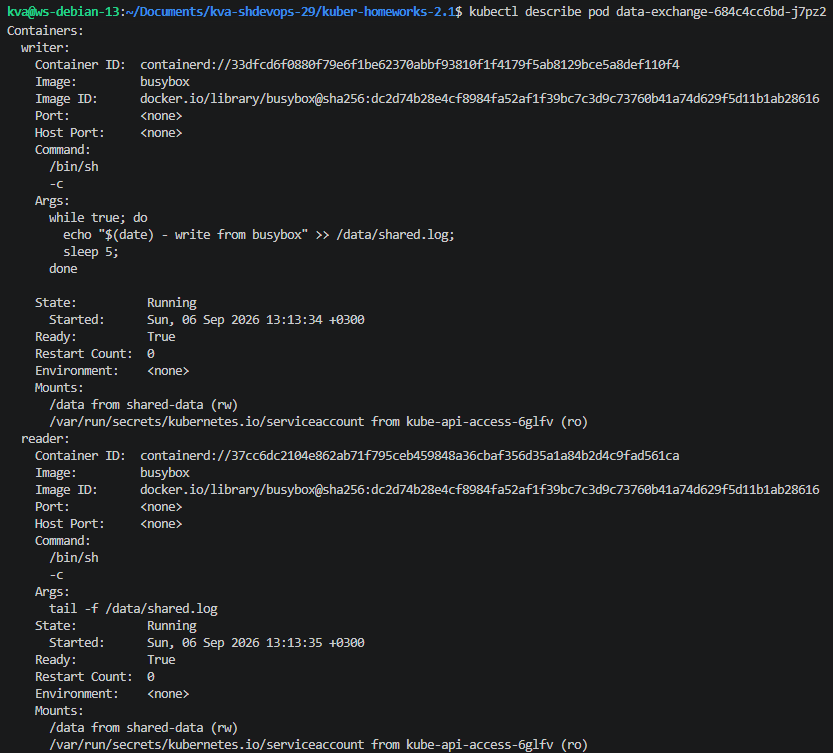
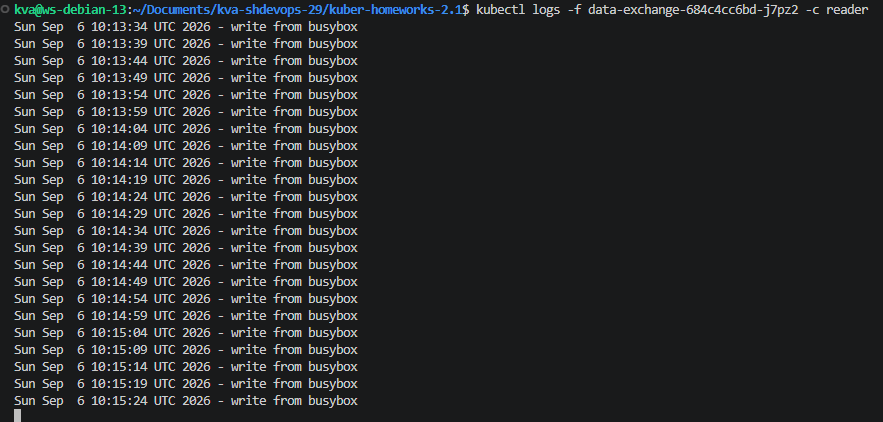
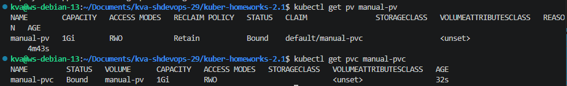
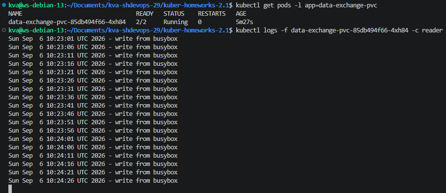
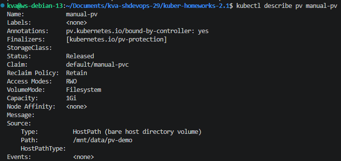
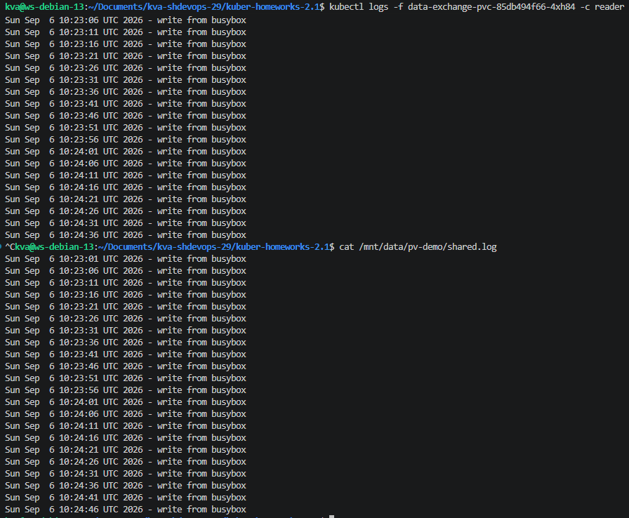
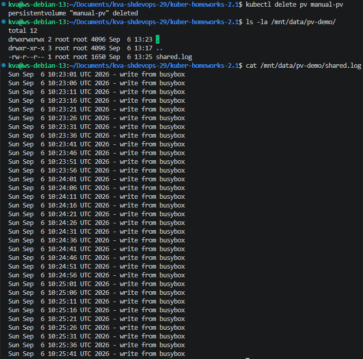
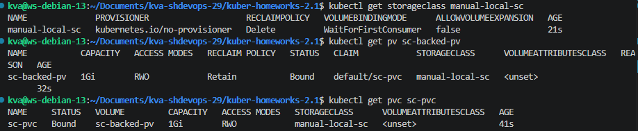
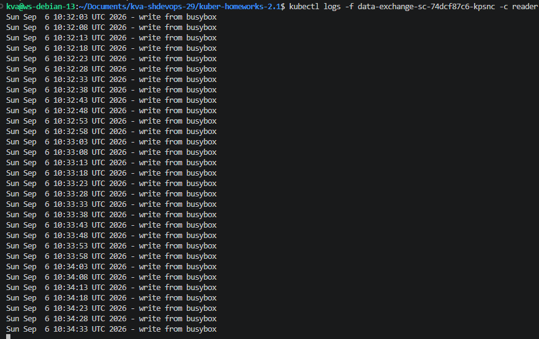

## Задание 1
- [manifests/task1-containers-data-exchange.yaml](manifests/task1-containers-data-exchange.yaml)

###  Describe pod со статусом контейнеров


### Вывод ```tail -f```


## Задание 2
- [manifests/task2-pv-pvc.yaml](manifests/task2-pv-pvc.yaml)

### Статус PV и PVC
  

### Вывод ```tail -f```
  

### Describe pv со статус Released
  

### Состояние файла до и после удаления PV
  
  

Пояснение: Удаление объекта ```PersistentVolume``` в Kubernetes — это удаление только API-объекта-описания, метаданных о томе в etcd кластера. Ресурс ```hostPath``` не подразумевает никакого провизионера (kubernetes.io/no-provisioner/встроенный hostPath плагин), который бы физически чистил диск при удалении PV. Реальные файлы на файловой системе ноды остаются нетронутыми — Kubernetes про них просто «забывает» на уровне API, но с диском ничего не делает. Чтобы удалить данные, администратору нужно вручную зайти на ноду и стереть директорию.


## Задание 3
- [manifests/task3-sc.yaml](manifests/task3-sc.yaml)

### Get storageclass / pv / pvc


### Вывод ```tail -f```
