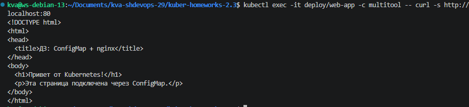
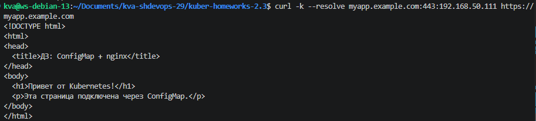
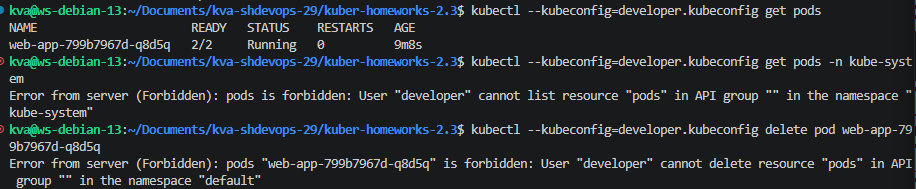

## Задание 1
- [manifests/task1-deployment.yaml](manifests/task1-deployment.yaml)
- [manifests/task1-configmap-web.yaml](manifests/task1-configmap-web.yaml)

### Вывод ```curl```


## Задание 2
- [manifests/task2-ingress-tls.yaml](manifests/task2-ingress-tls.yaml)
- [manifests/task2-secret-tls.yaml](manifests/task2-secret-tls.yaml)

### Вывод ```curl -k```
  

## Задание 3
- [manifests/task3-role-pod-reader.yaml](manifests/task3-role-pod-reader.yaml)
- [manifests/task3-rolebinding-developer.yaml](manifests/task3-rolebinding-developer.yaml)

### Команды для генерации и подписи сертификатов
```bash
# Ключ и запрос на сертификат (CSR) для пользователя "developer"
openssl genrsa -out developer.key 2048
openssl req -new -key developer.key -out developer.csr -subj "/CN=developer/O=devteam"
sudo cp /var/snap/microk8s/current/certs/ca.* .
sudo chown $USER:$USER ca.*
openssl x509 -req -in developer.csr \
  -CA ca.crt -CAkey ca.key -CAcreateserial \
  -out developer.crt -days 365
```

### Скриншот проверки прав
