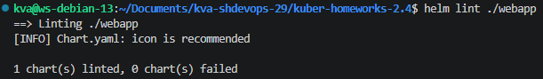
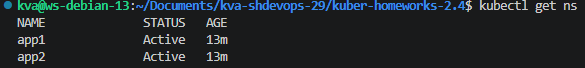
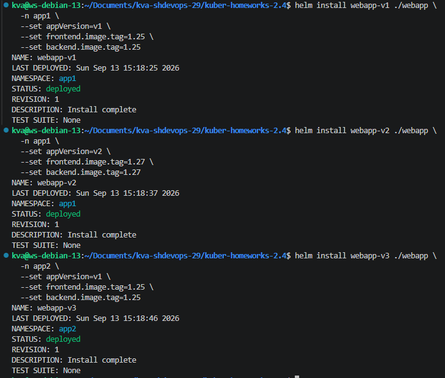
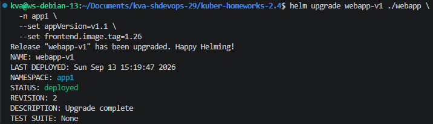
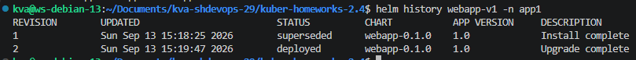
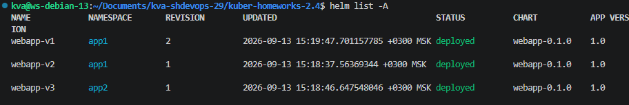
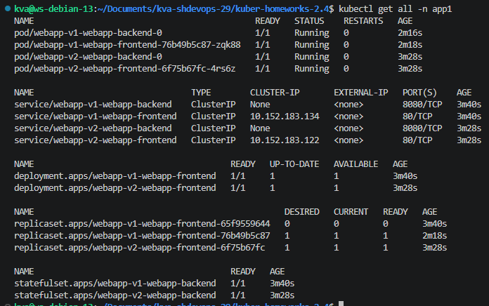
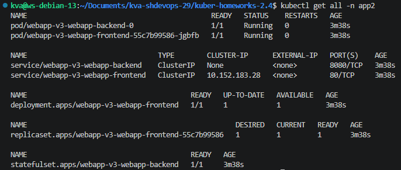

## Задание 1. Подготовка Helm-чарта
- [webapp/Chart.yaml](webapp/Chart.yaml)  
- [webapp/values.yaml](webapp/values.yaml)  
- [webapp/templates/_helpers.tpl](webapp/templates/_helpers.tpl)  
- [webapp/templates/frontend-deployment.yaml](webapp/templates/frontend-deployment.yaml)
- [webapp/templates/frontend-service.yaml](webapp/templates/frontend-service.yaml)
- [webapp/templates/backend-statefulset.yaml](webapp/templates/backend-statefulset.yaml)
- [webapp/templates/backend-service.yaml](webapp/templates/backend-service.yaml)

### Вывод ```helm lint```


## Задание 2. Запуск двух версий в разных namespace

### Вывод ```kubectl get ns```
  

### Релиз версий  
  

### Обновление релиза  
  
  

### Итоговый результат
  
  
  

