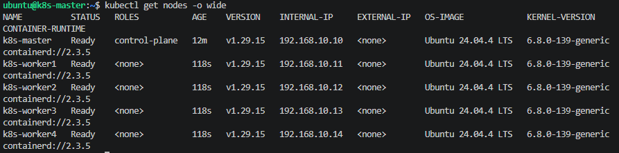

## Задание 1. Установить кластер k8s с 1 master node  

### Вывод ```get nodes```
  
Пояснение:  
Был вынужден сменить версию Ubuntu с 20.04 на 24.04, так как реализовывал установку с помощью terraform и ansible в yandex.cloud. (Проблема с разницей версий локального Python и в 20.04)