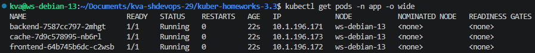
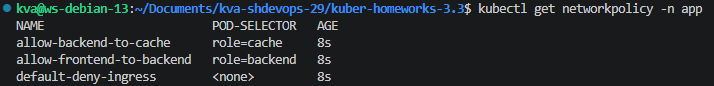
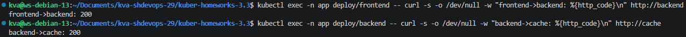
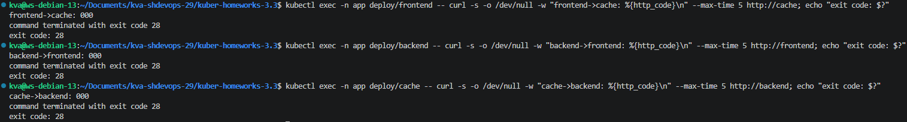

## Задание 1. Создать сетевую политику или несколько политик для обеспечения доступа  
- [manifests/00-namespace.yaml](manifests/00-namespace.yaml)  
- [manifests/01-deployments.yaml](manifests/01-deployments.yaml)  
- [manifests/02-services.yaml](manifests/02-services.yaml)  
- [manifests/03-networkpolicies.yaml](manifests/03-networkpolicies.yaml)

### Вывод ```get pods```
  

### Применение networkpolicies  
  

### Проверка разрещающих правил  
  

### Проверка запрещающих правил  

