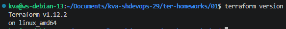
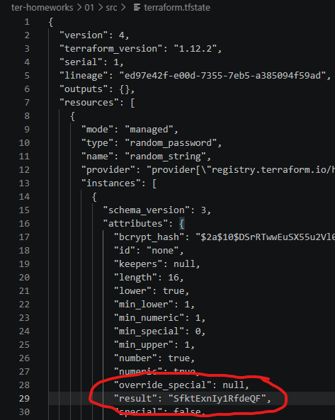
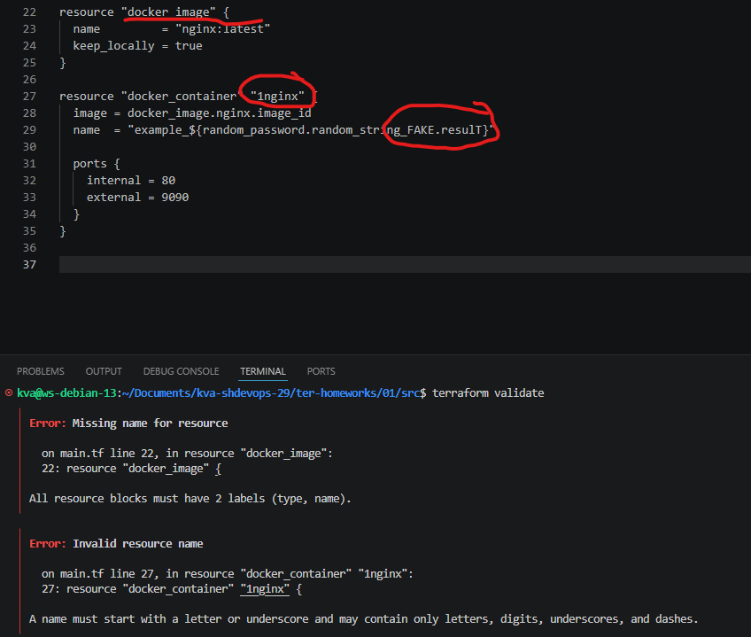
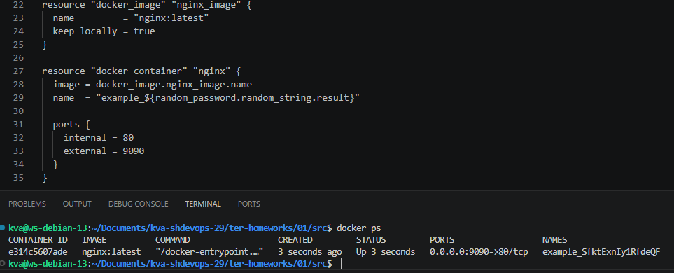
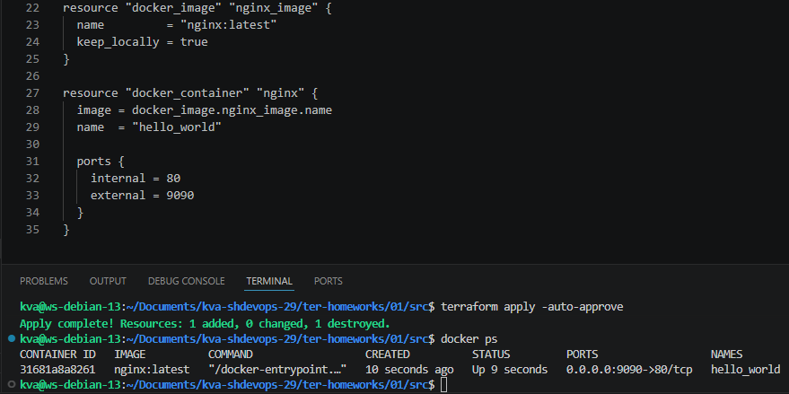
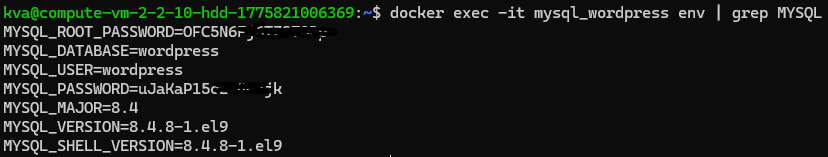

# **[Ссылка на итоговый код](https://github.com/JefiJFire/kva-shdevops-29/blob/main/ter-homeworks/01/src/main.tf)**
------

Установлена требуемая версия Terraform.  
  

Примечание: только когда стал заполнять решение - обнаружил, что на удаленную ВМ не поставилось расширение terraform для VS Code. Поэтому на скриншотах синтаксис не выделяется.  

------
# **Решение задания 1**

1. Успешно скачено и настроено.  
2. Личную информацию допустимо сохранить в файле ```personal.auto.tfvars```.  
3. Ответ на скриншоте ниже. Переменная result:  
  
4. Ошибки намерено были допущены в четырех местах:  
 - отсутствие наименования ресурса "docker_image";  
 - наименование ресурса "docker_container" начали с числа, что недопустимо;  
 - переменная image в ресурсе "docker_container" не может быть отработана, так как некорректное имя ресурса "docker_image";  
 - в переменной name используется имя несуществующего ресурса "random_string_FAKE".  
Ниже представлен скриншот с выделенными ошибками в блоке кода и выводом командый ```terraform validate```:

5. Скриншот с исправленным фрагментом кода и вывод команды ```docker ps```:  
  
6. Ключ ```-auto-approve``` автоматически подтверждает выполнение операции, без интерактивного запроса. Это может быть черевато тем, что terraform применит все изменения, в том числе удаление и/или пересоздание ресурсов, даже при наличии ошибок в конфигурации. Тем самым это может привести к разрушительным изменениям для боевой инфростуктуры. Лучше всего это подойдет для тестовой среды разработки, где процессы автоматизированы через CI\CD и скрипты.  
Далее представлен скриншот с изменением блока кода для смены имени docker-контейнера на ```hello_world``` и вывод команды ```docker ps```:  

8. Ресурсы уничтожаются командой ```terraform destroy```. Содержимое ```terraform.tfstate```:
```
{
  "version": 4,
  "terraform_version": "1.12.2",
  "serial": 11,
  "lineage": "ed97e42f-e00d-7355-7eb5-a385094f59ad",
  "outputs": {},
  "resources": [],
  "check_results": null
}
```
9. Docker-образ не был удален, так как в конфигурации, в ресурсе "docker_image" используется переменная ```keep_locally```, которая отвечает за сохранение docker-образа.
Цитата из документации:
```
keep_locally (Boolean) If true, then the Docker image won't be deleted on destroy operation. If this is false, it will delete the image from the docker local storage on destroy operation.
```


------

## Дополнительное задание (со звёздочкой*)


# **Решение задания 2**

Итоговый код можно изучить [здесь](t2/main.tf).  
Ниже представлен скриншот, что в контейнере есть переданные ```env```:  


# **Решение задания 3**
Выполнение ```tofu apply``` не прошло успешно, так как ресурс ```registry.opentofu.org``` отдает 403 Forbidden. Это происходит на моменте инициализации с помощью ```tofu init```, так как tofu производит замену адреса ```registry.terraform.io/hashicorp/random => registry.opentofu.org/hashicorp/random```, но в файле пользователя ```.terraformc``` у нас указано зеркало только для оригинального регистри terraform. Есть ещё небольшая ошибка в том, что в ```main.tf``` мы указываем версию ```~>1.12.0```, но это быстро правится просто заменой на версию ```~>1.11.0```, так как версия ```tofu``` установлена 1.11.6.
